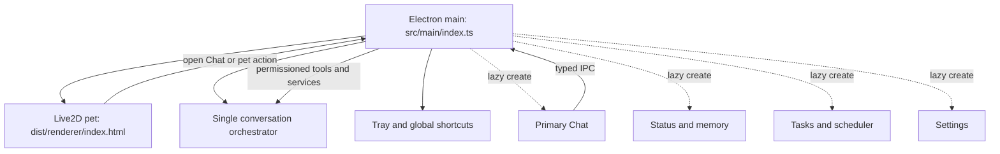

# Cyrene Desktop: Unified Architecture and System Specification

## 1. Product Vision

Cyrene is a Windows-first AI desktop companion: a lightweight Live2D presence for everyday interaction, backed by one capable agent runtime for conversation, memory, tools, voice, and consent-based sensory context.

The architecture follows four rules:

- **One runtime:** `src/main/index.ts` is the only application entry and the compiled renderer is the only shipped UI runtime.
- **One brain:** all conversation and tool use flows through the primary orchestrator. The pet never hosts a second provider loop, tool runner, memory path, or TTS stack.
- **One chat:** the full Chat window is the only message-composition interface. Pet interactions may open Chat but cannot send messages independently.
- **Bounded capabilities:** privileged actions remain behind typed IPC, sender validation, permission policy, and explicit consent where required.

## 2. Canonical Runtime and Legacy Boundary

| Concern | Canonical implementation | Release policy |
| --- | --- | --- |
| Electron main process | `src/main/index.ts` -> `dist/main/main/index.js` | Shipped and used by `npm start`, the batch launcher, and packaging |
| Desktop pet renderer | `src/renderer/index.html` -> `dist/renderer/index.html` | Shipped |
| Primary chat | `src/renderer/chat/` | Shipped; the only conversational UI |
| Auxiliary panels | `src/renderer/sidebar/`, `src/renderer/tasks/`, `src/renderer/settings/` | Shipped and created lazily on demand |
| Root `main.js`, `preload.js`, `cyrene_companion.html` | Legacy migration references | Explicitly excluded from packaging and never selected by a supported launcher |

The legacy root files may contain useful historical behavior, but they are not an alternative runtime and must not regain provider, shell, filesystem, screenshot, memory, TTS, or chat authority.

## 3. Startup and Window Lifecycle

When started through `npm start` or `Start Cyrene.bat`:

1. Electron acquires the single-instance lock. A second launch focuses an existing Chat window when available, otherwise the pet.
2. Runtime services and provider/tool adapters are initialized once.
3. The modern Live2D pet window is created from `dist/renderer/index.html`.
4. The system tray and global shortcuts are registered.
5. Chat, Status, Tasks, Settings, voice-call, and other auxiliary windows remain uncreated until requested.

Lazy creation is intentional: auxiliary panels are neither visible nor silently background-loaded at startup.

## 4. Global Shortcuts

| Shortcut | Action |
| --- | --- |
| `Alt+C` | Show or hide the desktop pet |
| `Alt+1` | Open or focus Chat |
| `Alt+2` | Open or focus Status |
| `Alt+3` | Open or focus Tasks |
| `Alt+S` | Open or focus Settings |

Shortcut registration failures are logged without preventing startup.

## 5. Runtime Topology

## 6. Trust and Capability Boundaries

- Renderers use the preload bridge and declared IPC channels; they do not receive Node.js authority.
- Navigation and uncontrolled window creation are denied for application windows.
- Screen context is producer-bound, revocable, and permissioned. No companion-only screenshot bypass exists.
- System-audio awareness is limited to minimized activity/session metadata. It does not expose raw PCM, recording, or transcription.
- Companion policy denies filesystem mutation, arbitrary command execution, and dynamically installed process/MCP tools.
- Provider secrets remain in the main process and must be represented to renderers through redacted DTOs.

## 7. English Product Contract

Shipped user-facing UI, application-authored model context, prompts, errors, tool output, and window labels are English. Automated contract tests scan the shipping surface for Han-script regressions.

## Local model policy

The default conversational runtime is the user-selected local Ollama-compatible endpoint. A local provider is keyless only when its configured endpoint resolves to loopback (`localhost`, `127.0.0.1`, or `::1`) and both Base URL and Model ID are present. The same rule applies to primary chat, proactive messages, scheduler runs, calls, translation, vision, and memory judge/resolver/compression. Independent vision and Game Bot default to the local `qwen2.5vl:7b` model. Non-loopback and cloud/legacy provider profiles require their own saved API key; local defaults are never copied into those profiles. Saved main-model, vision, and Game Bot secrets use redacted `hasKey` DTOs, retain the stored key when a blank value is submitted, and clear it only through the explicit clear action.

## Pet interaction contract

- Normal primary click/tap pets Cyrene and must not begin a drag.
- `Alt` + primary-button drag moves the pet.
- Pressing or releasing `Alt` while the pointer is already over the pet updates interaction mode immediately; the user does not need to leave and re-enter the window.
- `Alt` + mouse wheel resizes the pet while preserving bounded, persisted geometry. The renderer owns exactly one wheel listener so resizing cannot be applied twice.
- Spoken replies appear in the speech bubble. The distinct thought bubble shows safe activity status only, such as thinking, bounded tool activity, finishing, or a sanitized error; it never shows model reasoning, raw chain-of-thought, prompts, tool arguments, or provider internals.
- The AG-UI run channel accepts requests only from the trusted primary Chat window, returns sanitized English errors, and does not expose secrets or model configuration to renderer callers.
- Pet movement, resize, petting, and presentation IPC accepts messages only from the owning pet WebContents/frame; auxiliary or forged senders are rejected.

The following internal data is permitted when it is hidden from users and models:

- raw Live2D motion/expression asset identifiers;
- stable provider identifiers required to read existing settings;
- compatibility aliases for legacy multilingual external input;
- third-party licenses, vendor data, and user-provided content.

English aliases are presented at every user- or model-facing boundary.

## 8. Live2D Assets

- Model: `assets/models/cyrene/Cyrene.model3.json`
- Texture: `assets/models/cyrene/texture_0.png`
- Motions and expressions: `assets/models/cyrene/motions/`

Raw asset names may be non-English, but shared action APIs expose tested English labels such as `wink`, `smile`, `sparkle`, and `reset`.

## 9. Release Qualification Status

The latest resource-bounded full-suite run passes at 235 files and 1,780 tests with zero failures. Earlier repeated clean runs remain recorded, concurrent history isolation passes in two simultaneous processes (6/6 each), source diff hygiene passes, and the full production build passes with 1,102 renderer modules in the current run. Live loopback Ollama smoke also passes: `llama3.1:latest` returned exactly `CYRENE_LOCAL_OK`, and `qwen2.5vl:7b` described a 1x1 white PNG as `white`. Rust 1.98 and Visual Studio 2022 Build Tools are installed; Rust/Cargo now reside on drive `D:`, the npm cache is `D:\npm-cache`, and the screenshot helper built, staged, and was verified successfully. The temporary `X:` mapping is no longer present, and drive `C:` has approximately 8.9 GB free. Electron-builder packaging previously stalled or was interrupted, so a final unpacked package and packaged launch are still not verified. Manual hardware, latency, and soak gates remain open.
