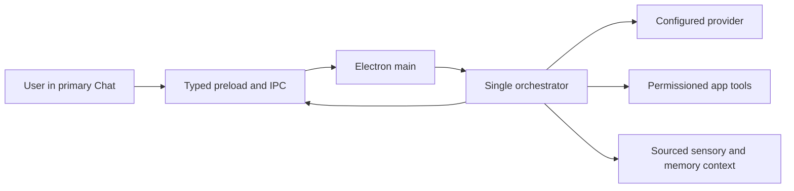

# System Architecture

## 1. Runtime Boundary

Cyrene ships one TypeScript/Electron runtime:

- `src/main/index.ts` compiles to the package main entry.
- `src/renderer/index.html` compiles to the Live2D pet renderer.
- `src/renderer/chat/` is the only conversational UI.
- Status, Tasks, Settings, and other auxiliary windows are created lazily.

Root `main.js`, `preload.js`, and `cyrene_companion.html` are unshipped migration references. They are not a supported lightweight mode and must not host an independent model, memory, TTS, tool, or capture runtime.

## 2. Main-Process Responsibilities

The main process owns window lifecycle, single-instance enforcement, global shortcuts, system tray, settings and secret stores, provider/tool configuration, permissions, sensory adapters, task services, ASR/TTS/call services, RAG, and the conversation orchestrator.

Startup initializes shared services once, then creates the pet and tray. Auxiliary BrowserWindows are created only when the user requests them.

## 3. Renderer Boundary

Renderers communicate through the typed preload bridge. Application windows deny uncontrolled navigation and window creation. Privileged handlers validate their sender and payload; renderers cannot elevate permission level or obtain provider secrets directly.

The desktop pet may request presentation actions or open Chat. It has no independent message-send path and no direct provider/tool authority.

Pet IPC authenticates the owning pet WebContents/frame. Normal click is petting, movement requires `Alt` + primary-button drag, and resizing requires `Alt` + wheel. Exactly one renderer wheel listener owns resize dispatch.

## 4. Companion-Safe Capability Policy

- **Allowed:** configured provider network access, explicitly registered application tools, consented screen observation, and opt-in minimized system-audio metadata.
- **Denied:** arbitrary commands, unrestricted process execution, filesystem mutation, dynamically installed MCP/process tools, renderer-driven permission escalation, and raw system-audio capture.
- **Screen consent:** capture authorization is producer-bound, time-bounded, and revocable.
- **Audio awareness:** the adapter exposes bounded application/session/activity metadata only. It cannot return PCM, recordings, transcripts, buffers, or device handles.

These restrictions are enforced in the main process, not by prompt text alone.

## 5. Conversation and Context Flow

Application-authored context is source-labelled and English. The assistant must not claim to see, hear, remember, or complete an action unless the corresponding trusted context or tool result exists.

The local Ollama provider may omit an API key only for an explicit loopback endpoint with a configured model ID. Non-loopback and cloud/legacy profiles remain key-required.

## 6. English and Compatibility Data

Shipped UI, prompts, model context, errors, and tool output are English under automated regression scans. Stable provider keys, raw Live2D asset IDs, legacy multilingual input aliases, licenses, vendor data, and user content may remain non-English internally. User- and model-facing boundaries expose English short names and action aliases.

## 7. Windows Packaging

`npm run package:win:dir` builds and verifies the Rust screenshot helper before electron-builder runs. A Rust toolchain with `cargo` on `PATH` is required.

Current automated evidence is a latest clean run of 232 files/1,766 passing tests, earlier repeated clean runs, a passing production build with 1,100 renderer modules in the current run, two concurrent 6/6 history processes, and a clean diff check. Live loopback Ollama chat and VLM smoke pass; independent vision and Game Bot default to local `qwen2.5vl:7b`. Rust 1.98 and VS 2022 Build Tools are installed, Rust/Cargo and the npm cache are on `D:`, and the screenshot helper built, staged, and was verified successfully. The temporary `X:` mapping is absent and drive `C:` had approximately 8.9 GB free. Final directory packaging and packaged launch were not verified after electron-builder stalled or was interrupted. Hardware qualification therefore remains open.

The pet's thought surface is an activity-status channel only. It may show bounded states such as thinking, tool activity, finishing, or a sanitized failure; model reasoning and raw chain-of-thought never belong in renderer payloads or logs.
